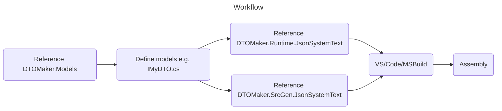

# DTOMaker

[](https://github.com/datafac/dtomaker-all/actions/workflows/dotnet.yml)


*Warning: This is pre-release software under active development. Breaking changes may occur.*

Model-driven compile-time source generators for quickly creating polymorphic, freezable DTOs (Data Transport Objects) 
supporting various serialization protocols:
- JSON (System.Text.Json)
- JSON (Newtonsoft.Json)
- MessagePack 2.x
- MemBlocks [coming soon]

## Workflow


Models are defined as C# interfaces with additional attributes. So let's start with a non-trivial model. 
Here's how to define a generic recursive tree type with an example closed instance:

```C#
[Entity][Id(1)]
public interface ITree<TK, TV> : IEntityBase
{
    [Member(1)] int Count { get; set; }
    [Member(2)] TK Key { get; set; }
    [Member(3)] TV Value { get; set; }
    [Member(4)] ITree<TK, TV>? Left { get; set; }
    [Member(5)] ITree<TK, TV>? Right { get; set; }
}
[Entity][Id(2)]
public interface IMyTree : ITree<String, Octets> { }
```
The following implmentation will be 
generated (simplified for readability):

```C#
[JsonPolymorphic]
[JsonDerivedType(typeof(MyTree))]
public partial class Tree_2_String_Octets : EntityBase, ITree<String, Octets>, IEquatable<Tree_2_String_Octets>
{
    [JsonIgnore] private Int32 _Count = default;
    public Int32 Count { get => _Count; set => _Count = value; }

    [JsonIgnore] private string _Key = string.Empty;
    public string Key { get => _Key; set => _Key = value; }

    [JsonIgnore] private byte[] _Value = Array.Empty<byte>();
    public byte[] Value { get => _Value; set => _Value = value; }
    Octets ITree<String, Octets>.Value
    {
        get => _Value.Length == 0 ? Octets.Empty : new Octets(_Value);
        set => _Value = value.ToByteArray();
    }

    [JsonIgnore] private Tree_2_String_Octets? _Left;
    public Tree_2_String_Octets? Left { get => _Left; set => _Left = value; }
    ITree<String, Octets>? ITree<String, Octets>.Left
    {
        get => _Left;
        set => _Left = value is null ? null : Tree_2_String_Octets.CreateFrom(value));
    }

    [JsonIgnore] private Tree_2_String_Octets? _Right;
    public Tree_2_String_Octets? Right { get => _Right; set => _Right = value; }
    ITree<String, Octets>? ITree<String, Octets>.Right
    {
        get => _Right;
        set => _Right = value is null ? null : Tree_2_String_Octets.CreateFrom(value);
    }
}
public partial class MyTree : Tree_2_String_Octets, IMyTree, IEquatable<MyTree>
```
# Development
## In progress
- MessagePack serialization

## Coming soon
- MemBlocks serialization
- Protobuf.Net serialization
- custom struct members (to avoid primitive obsession)
- global interface equality comparer
- reservation (hidden members)

## Coming later
- generic entities
- model.json generation
- command-line alternative
- variable length arrays
- logical value equality

## How to sponsor
If you find these tools useful, please consider sponsoring my work on GitHub 
at https://github.com/sponsors/Psiman62
or buy me a coffee at https://www.buymeacoffee.com/psiman62

## License
This project is licensed under the Apache-2.0 License - see the [LICENSE](LICENSE) file for details.
