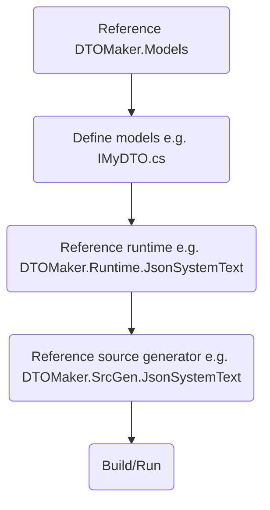

# DTOMaker

[](https://github.com/datafac/dtomaker-all/actions/workflows/dotnet.yml)


*Warning: This is pre-release software under active development. Breaking changes may occur.*

Model-driven compile-time source generators for quickly creating polymorphic, freezable DTOs (Data Transport Objects) 
supporting various serialization protocols:
- JSON (System.Text.Json)
- JSON (Newtonsoft.Json)
- MessagePack 2.x
- MemBlocks

## Workflow


Models are defined as C# interfaces with additional attributes. So let's start with a non-trivial model. 
Here's how to define a polymorphic, recursive tree type:

```C#
using DTOMaker.Models;
using DTOMaker.Runtime;
namespace MyModels;
[Entity(1)] public interface INode : IEntityBase
{
    [Member(1)] String Key { get; set; } 
}
[Entity(2)] public interface IStringNode : INode
{
    [Member(1)] String Value { get; set; } 
}
[Entity(3)] public interface INumberNode : INode
{
    [Member(1)] Int64 Value  { get; set; } 
}
[Entity(4)] public interface ITree : IEntityBase
{
    [Member(1)] ITree? Left  { get; set; }
    [Member(2)] ITree? Right { get; set; }
    [Member(3)] INode? Node  { get; set; }
}
```
When you add a reference to the DTOMaker.SrcGen.JsonSystemText package, the implmentations will be generated 
in the MyModels.JsonSystemText namespace.

# Development
## In progress
- custom type members (to avoid primitive obsession)

## Coming soon
- global interface equality comparer
- reservation (hidden members)

## Coming later
- MessagePack 3.x serialization
- Orleans serialization
- Protobuf.Net serialization
- generic entities
- model.json generation
- command-line alternative
- variant native type support
- variable length arrays
- logical value equality

## How to sponsor
If you find these tools useful, please consider sponsoring my work on GitHub 
at https://github.com/sponsors/Psiman62
or buy me a coffee at https://www.buymeacoffee.com/psiman62

## License
This project is licensed under the Apache-2.0 License - see the [LICENSE](LICENSE) file for details.
