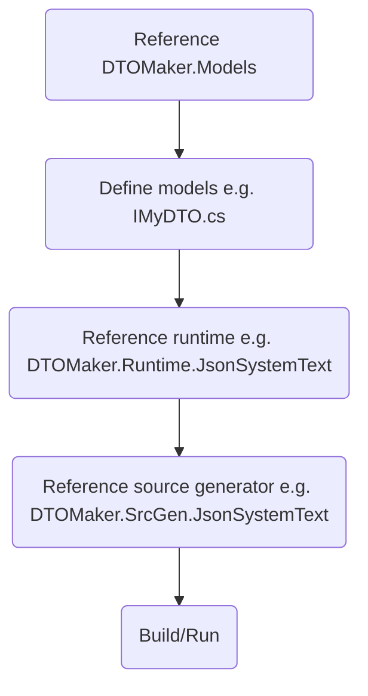

# DTOMaker

[](https://github.com/datafac/dtomaker-all/actions/workflows/dotnet.yml)


*Warning: This is pre-release software under active development. Breaking changes may occur.*

## TLDR

This project contains model-driven compile-time source generators for quickly creating 
and maintaining polymorphic, immutable DTOs (Data Transport Objects) supporting various
serialization protocols.

## Open Source Declaration

This is an open source project. This means that you are free to use the source code
and released binaries within the terms of the license. Use of such constitutes agreement
to the license terms.

This project is maintained by developers who enjoy doing this. Please remember that we
are not paid to do this, and that developers are real humans that  families, homes, 
vehicles and other expenses.

If you find this project useful in any way, including generating revenue for your
organisation, we ask that you consider sponsoring this project financially. We leave
it up to you to decide how much. Any amount is appreciated.

You can [contribute via GitHub Sponsors](https://github.com/sponsors/Psiman62).

## Features
- Models defined via C# interfaces with attributes.
  - Source generators create implementations at compile time.
- Properties can be basic .NET types such as integers, floats, strings, Guid, etc.
  - Raw byte arrays are supported using the built-in Octets type.
  - Other common types such as DateTime, DateTimeOffset, TimeSpan are supported by built-in converters.
  - User-defined value types can be supported via user-defined converters to built-in types.
- Nullable value types.
- Polymorphic types.
- Freezable types: Instances are mutable until frozen.
- Serialization protocols:
  - JSON (System.Text.Json)
  - JSON (Newtonsoft.Json)
  - MessagePack 2.x
  - MemBlocks
- Collections. Collections based on balanced binary trees are supported.

## Example

```C#
using DTOMaker.Models;
namespace MyModels;
[Entity(1)] public interface INode : IEntityBase
{
    [Member(1)] String Key { get; set; } 
}
[Entity(2)] public interface IStringNode : INode
{
    [Member(1)] String Value { get; set; } 
}
[Entity(3)] public interface INumberNode : INode
{
    [Member(1)] Int64 Value  { get; set; } 
}
[Entity(4)] public interface ITree : IEntityBase
{
    [Member(1)] ITree? Left  { get; set; }
    [Member(2)] ITree? Right { get; set; }
    [Member(3)] INode? Node  { get; set; }
}
```

## Workflow

```mermaid
flowchart TB
    def(Define models e.g. IMyDTO.cs)
    ref1(Reference DTOMaker.Models)
    ref2(Reference runtime e.g. DTOMaker.Runtime.JsonSystemText)
    ref3(Reference source generator e.g. DTOMaker.SrcGen.JsonSystemText)
    bld(Build/Run)
    ref1-->def
    def-->ref2
    ref2-->ref3
    ref3-->bld
```

# Ongoing Development
## Coming next in V2.0
- common interface support across all serializers
- BitSet type

## Coming later in V2.1+
- ref type converters
- incremental serialization
- MessagePack 3.x serialization
- Orleans serialization
- Protobuf.Net serialization
- model.json generation
- command-line alternative
- variant native type support
- variable length arrays
- logical value equality
- common pattern extensions

# License
This project is licensed under the Apache-2.0 License - see the [LICENSE](LICENSE) file for details.

## Miscellaneous
- This readme was last updated 3rd Mar 2026.
