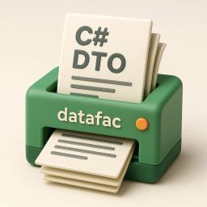
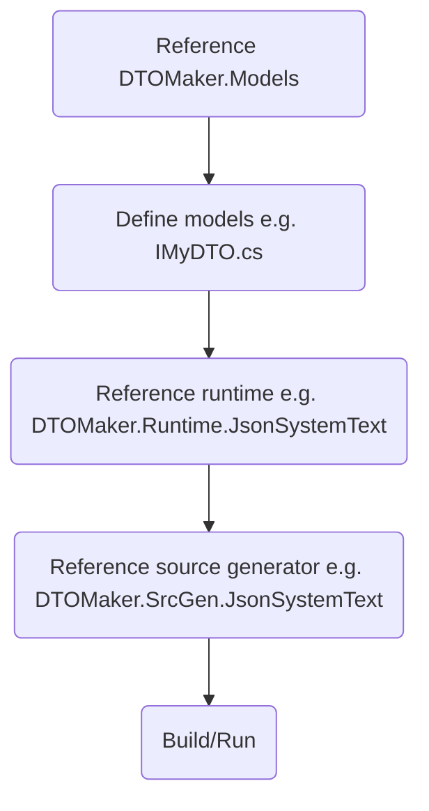

# DTOMaker

[](https://github.com/datafac/dtomaker-all/actions/workflows/dotnet.yml)


*Warning: This is pre-release software under active development. Breaking changes may occur.*

This project contains model-driven compile-time source generators for quickly creating 
and maintaining polymorphic, immutable DTOs (Data Transport Objects) supporting various
serialization protocols.

## Open Source Maintenance Fee Introduction

To ensure the long-term sustainability of this project, we are introducing
an [Open Source Maintenance Fee](https://opensourcemaintenancefee.org). This
fee is required to be paid by all users of this project who generate revenue
above defined thresholds. Non-revenue-generating use of the project, such as by 
hobbyists, charities and other non-profit organisations, any any organisation with
reveune below the minimum threshold, are not required to pay the fee.

You can [pay via GitHub Sponsors](https://github.com/sponsors/Psiman62).

We plan to enforce the maintenance fee starting with the release of V2.0 binaries. At that 
time, a EULA on binary releases requires payment of the Maintenance Fee.

Please see the Open Source Maintenance Fee section below for more information.

## V1.0 Features
- Models defined via C# interfaces with attributes.
  - Source generators create implementations at compile time.
- Properties can be basic .NET types such as integers, floats, strings, Guid, etc.
  - Raw byte arrays are supported using the built-in Octets type.
  - Other common types such as DateTime, DateTimeOffset, TimeSpan are supported by built-in converters.
  - User-defined value types can be supported via user-defined converters to built-in types.
- Nullable types.
- Polymorphic types.
- Freezable types: Instances are mutable until frozen.
- Serialization protocols:
  - JSON (System.Text.Json)
  - JSON (Newtonsoft.Json)
  - MessagePack 2.x
  - MemBlocks
- Collections. Collections based on balanced binary trees are supported.

## Example

```C#
using DTOMaker.Models;
namespace MyModels;
[Entity(1)] public interface INode : IEntityBase
{
    [Member(1)] String Key { get; set; } 
}
[Entity(2)] public interface IStringNode : INode
{
    [Member(1)] String Value { get; set; } 
}
[Entity(3)] public interface INumberNode : INode
{
    [Member(1)] Int64 Value  { get; set; } 
}
[Entity(4)] public interface ITree : IEntityBase
{
    [Member(1)] ITree? Left  { get; set; }
    [Member(2)] ITree? Right { get; set; }
    [Member(3)] INode? Node  { get; set; }
}
```

## Workflow

```mermaid
flowchart TB
    def(Define models e.g. IMyDTO.cs)
    ref1(Reference DTOMaker.Models)
    ref2(Reference runtime e.g. DTOMaker.Runtime.JsonSystemText)
    ref3(Reference source generator e.g. DTOMaker.SrcGen.JsonSystemText)
    bld(Build/Run)
    ref1-->def
    def-->ref2
    ref2-->ref3
    ref3-->bld
```

# Ongoing Development
## Coming soon in V1.x
- more custom (ref and value) type converters

## Coming later in V2.0+
- incremental serialization
- MessagePack 3.x serialization
- Orleans serialization
- Protobuf.Net serialization
- model.json generation
- command-line alternative
- variant native type support
- variable length arrays
- logical value equality
- common pattern extensions

# License
This project is licensed under the Apache-2.0 License - see the [LICENSE](LICENSE) file for details.

## Open Source Maintenance Fee


This project participates in the [Open Source Maintenance Fee](https://opensourcemaintenancefee.org).

The source code is freely available under the terms of the LICENSE. To
support sustainable maintenance, use of the project’s official releases
in revenue-generating activities requires adherence to the
[Open Source Maintenance Fee](./OSMFEULA.txt).

In short: if you use this project as part of generating revenue, the
Maintenance Fee applies. The fee directly supports the people maintaining
the project and helps ensure its long-term health.

To pay the Maintenance Fee, [become a Sponsor](https://github.com/sponsors/Psiman62).

## Miscellaneous
- This readme was last updated 20th Feb 2026.
